# ✅ ToDoo – More Than Just a To-Do App

ToDoo isn't your average task manager.  
It’s a thoughtfully designed **productivity platform** that goes beyond checklists. It’s built to help you **organize your tasks, reflect, and grow** — while fostering meaningful conversations around self-discipline, productivity, and purpose.

---

## 🧠 What Makes ToDoo Unique?

In a world dominated by apps that encourage procrastination, ToDoo is different. Here's how:
<<<<<<< HEAD

### ✍️ Smart To-Do Lists  
- Add tasks with titles, notes, and priority.
- Track your daily goals with ease.
- Designed for both quick entries and deep planning.

### 💬 Discussion Board  
- An in-app space to **discuss useful, life-enhancing topics** — like routines, motivation, deep work, and mental wellness.
- Not your usual social feed filled with memes and noise.
- This is **a place for focused minds**, not distractions.

### ⏱️ Built-In Focus Timer  
- Start a countdown and stay locked into the task at hand.
- Scientifically proven methods (like Pomodoro) inspired the feature.
- You’ll feel more present and less overwhelmed.

---

## 🎯 Why This App Was Made

**Most productivity apps only solve one problem: organizing tasks.**  
ToDoo solves a bigger problem: **building the mindset behind staying productive.**

This app was born out of the frustration of seeing people drown in endless scrolling, chatting about nothing, or mindlessly switching between tabs. ToDoo brings everything into one quiet, powerful space:

- **Tasks to take action.**  
- **Timers to stay disciplined.**  
- **Conversations to grow wiser.**

It’s like social media — if social media made you better.

---

## 📸 Screenshots

| 1 | 2 | 3 |
|---|---|---|
|  |  |  |
|  | 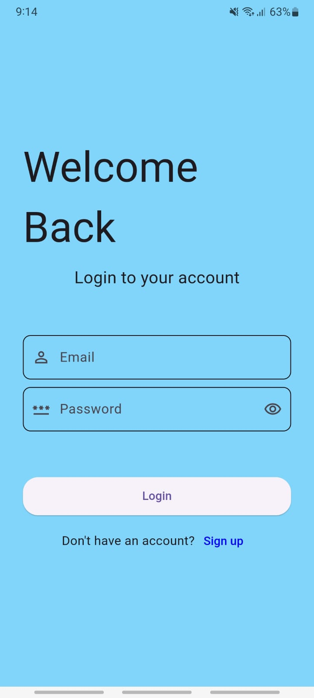 | 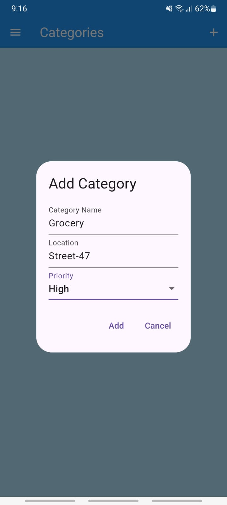 |
| 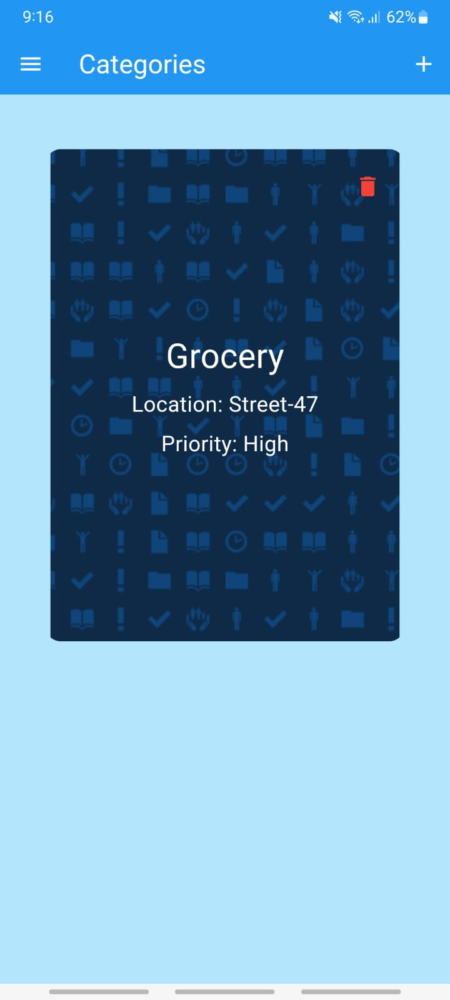 |  | 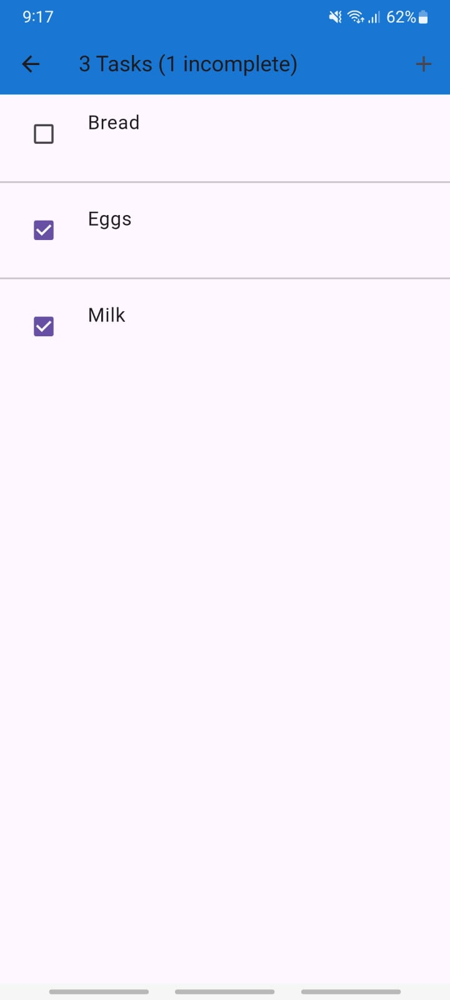 |
| 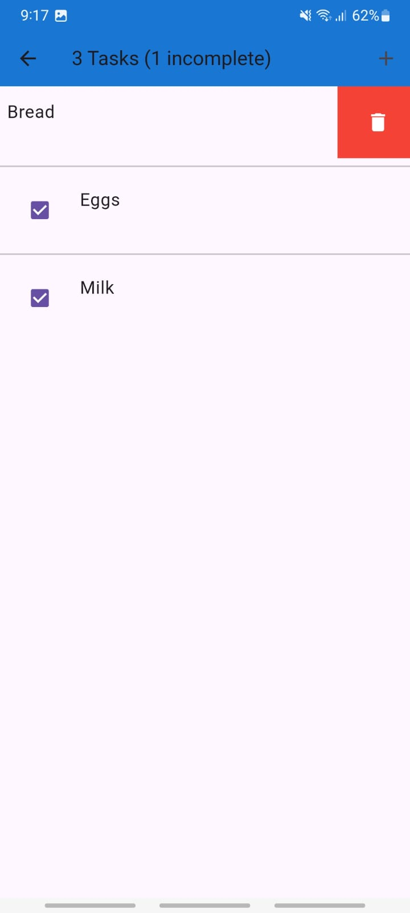 | 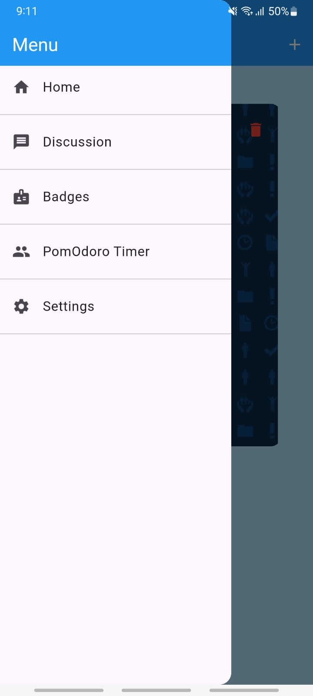 | 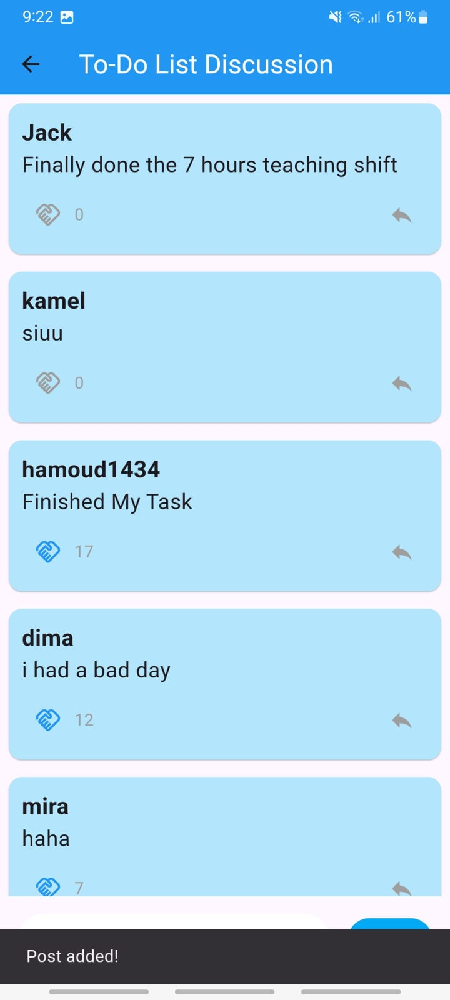 |
| 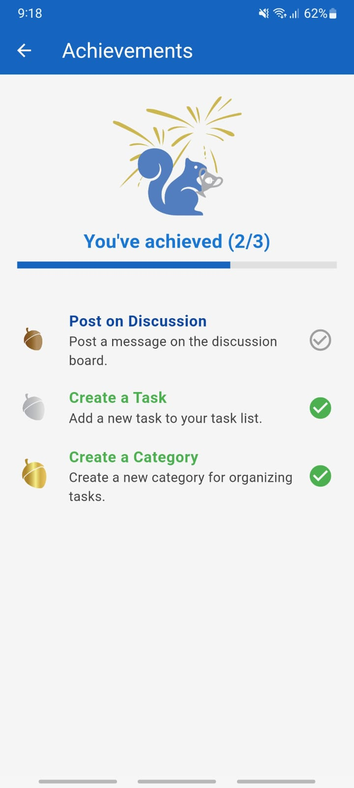 | 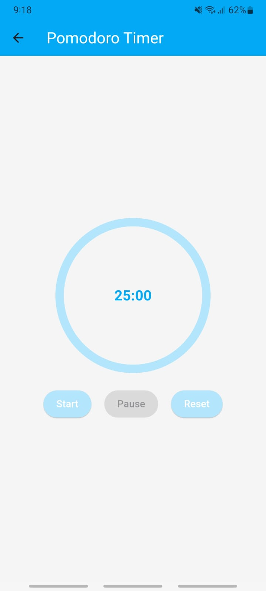 |  |
| 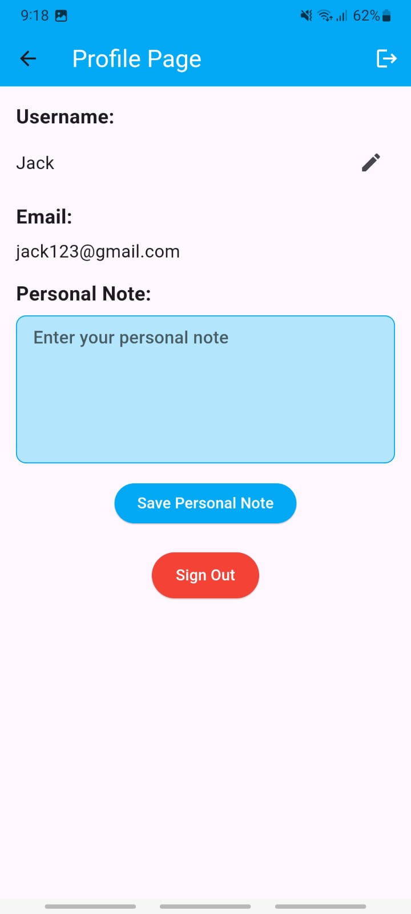 | 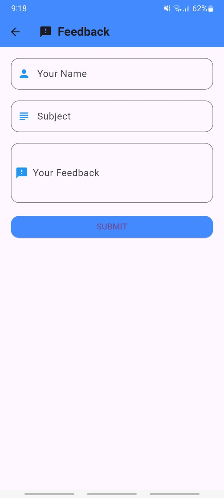 | |

---

## 🛠 Built With

- **Flutter** (Dart)
- **Custom UI Design**
- **Clean Architecture**
- **Offline-first support** (coming soon)
- **Lightweight, fast, and distraction-free**

---

## 🚀 What’s Coming Next?

- Notifications & Reminders  
- Dark Mode  
- Personal Insights & Stats  
- Private boards for teams  

---

## 🧾 Summary

ToDoo is not just for “getting things done.”  
It’s for those who want to **take control of their time**, **think clearly**, and **connect with others who care about growth.**

This isn’t another noisy app.  
This is your **productive corner of the digital world**.

---
=======

### ✍️ Smart To-Do Lists  
- Add tasks with titles, notes, and priority.
- Track your daily goals with ease.
- Designed for both quick entries and deep planning.

### 💬 Discussion Board  
- An in-app space to **discuss useful, life-enhancing topics** — like routines, motivation, deep work, and mental wellness.
- Not your usual social feed filled with memes and noise.
- This is **a place for focused minds**, not distractions.

### ⏱️ Built-In Focus Timer  
- Start a countdown and stay locked into the task at hand.
- Scientifically proven methods (like Pomodoro) inspired the feature.
- You’ll feel more present and less overwhelmed.

---

## 🎯 Why This App Was Made

**Most productivity apps only solve one problem: organizing tasks.**  
ToDoo solves a bigger problem: **building the mindset behind staying productive.**

This app was born out of the frustration of seeing people drown in endless scrolling, chatting about nothing, or mindlessly switching between tabs. ToDoo brings everything into one quiet, powerful space:

- **Tasks to take action.**  
- **Timers to stay disciplined.**  
- **Conversations to grow wiser.**

It’s like social media — if social media made you better.

---

## 🛠 Built With

- **Flutter** (Dart)
- **Custom UI Design**
- **Clean Architecture**
- **Offline-first support** (coming soon)
- **Lightweight, fast, and distraction-free**

---

## 🚀 What’s Coming Next?

- Notifications & Reminders  
- Dark Mode  
- Personal Insights & Stats  
- Private boards for teams  

---

## 🧾 Summary

ToDoo is not just for “getting things done.”  
It’s for those who want to **take control of their time**, **think clearly**, and **connect with others who care about growth.**

This isn’t another noisy app.  
This is your **productive corner of the digital world**.

---
